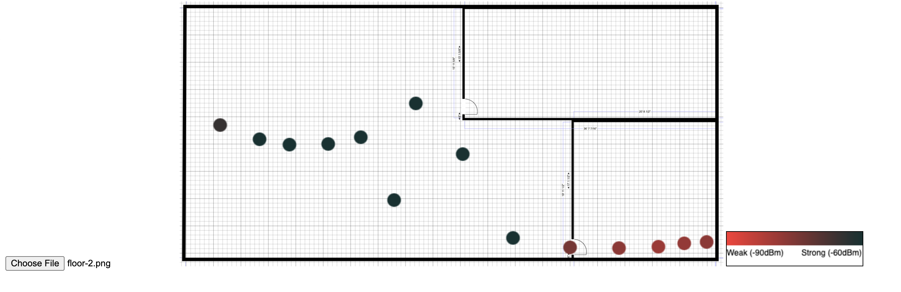

# wifi heatmap generator 



A web-based tool for creating WiFi signal strength heatmaps on floor plans. Upload an image of your floor plan and click points to measure and visualize WiFi signal strength across different locations.

## Requirements
- macOS (uses Apple Airport utility for signal strength measurements)
- Node.js

## Setup
```bash
npm install
npm start
```
Then open `http://localhost:3000` in your browser.

## Usage
1. Upload a floor plan image using the file input
2. Click different points on the floor plan to measure WiFi signal strength
3. The heatmap will automatically update with each measurement
   - Red colors indicate signal strength (darker = stronger signal)
   - Legend shows the signal strength scale from -90dBm (weak) to -60dBm (strong)
